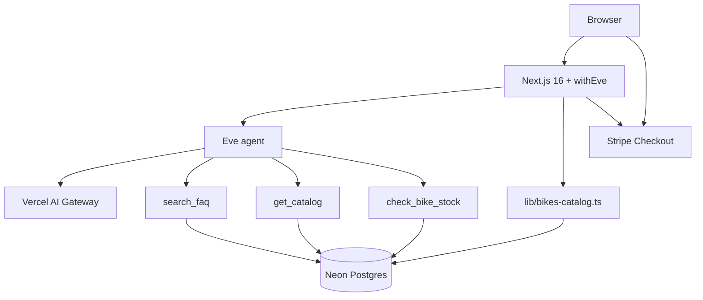

# Vur Selle Bikes

A UK bike-shop demo built for a Vercel Solutions Architect review: a **Next.js marketing site** (Frontend Cloud) plus an **Eve-powered FAQ and purchase advisor** (AI Cloud), with live inventory from Neon, tag-based catalog caching, and Stripe Checkout.

**Live demo:** _[add your Vercel deployment URL]_

---

## What it does

| Surface | Purpose |
|---------|---------|
| **Marketing site** | Server-rendered catalog, bike detail pages, hero and features |
| **FAQ bot** | RAG over Neon pgvector + live stock/catalog tools |
| **Basket & checkout** | Client basket (localStorage) + Stripe Checkout (test mode) |
| **Internals panel** | Per-turn latency, tool/skill trace, token and cost estimates |

**Outcome:** Policy answers grounded in FAQ data, stock-aware bike recommendations, and a credible commerce flow without inventing prices.

---

## Architecture



**Agent tools**

| Tool | Data |
|------|------|
| `search_faq` | `bike_faq` + pgvector embeddings |
| `get_catalog` | `bike_stock` (distinct on `model_id`) |
| `check_bike_stock` | `bike_stock` per warehouse |

**Stack:** Next.js 16 · React 19 · Eve 0.13.4 · AI SDK + Gateway · Neon · Stripe · Tailwind 4 · Geist

---

## Project structure

```
bike-shop/
├── agent/                 # Eve agent (filesystem-first)
│   ├── agent.ts           # Model + AI Gateway failover
│   ├── instructions.md    # Always-on system prompt
│   ├── channels/eve.ts    # Auth (local dev, OIDC, public browser)
│   ├── skills/            # faq_guide, purchase_advisor
│   └── tools/             # search_faq, get_catalog, check_bike_stock
├── app/                   # Next.js App Router
│   ├── api/checkout/      # Stripe Checkout session
│   ├── api/revalidate/    # On-demand ISR (tag `bikes`)
│   ├── basket/
│   └── bikes/             # Grid + ?bike={modelId} detail
├── components/            # UI including faq-bot-launcher.tsx
├── data/
│   └── bike-catalog.json  # Seed + static image paths
├── lib/
│   ├── bikes-catalog.ts   # Neon catalog + unstable_cache
│   └── bike-assets.ts     # Image paths from JSON
└── scripts/
    ├── schema.sql
    ├── migrate-catalog.sql
    ├── seed-stock.ts
    └── seed-faq.ts
```

---

## Prerequisites

- **Node 20+** (Eve scaffold targets Node 24; 20+ usually works locally)
- **pnpm**
- **Neon Postgres** with the `vector` extension
- **Vercel AI Gateway** access (chat + FAQ embeddings)
- **Stripe** test keys (optional, for checkout)

---

## Environment variables

Copy [`.env.example`](.env.example) to `.env.local`:

| Variable | Required | Purpose |
|----------|----------|---------|
| `DATABASE_URL` | Yes | Neon connection string |
| `REVALIDATE_SECRET` | Recommended | Protects `POST /api/revalidate` |
| `NEXT_PUBLIC_SITE_URL` | For Stripe | Checkout redirect base URL |
| `STRIPE_SECRET_KEY` | For checkout | Server-side Stripe |

AI Gateway auth for Eve is handled via Vercel OIDC / local dev helpers in [`agent/channels/eve.ts`](agent/channels/eve.ts)—see [Eve docs](https://eve.dev) for linking your Vercel team locally.

---

## Local setup

### 1. Install and configure

```bash
pnpm install
cp .env.example .env.local
# Edit .env.local — at minimum set DATABASE_URL
```

### 2. Database

**New database:** run [`scripts/schema.sql`](scripts/schema.sql) in the Neon SQL editor (or `psql`).

**Existing database** (missing `model_id` / display columns): run [`scripts/migrate-catalog.sql`](scripts/migrate-catalog.sql) once, then seed.

### 3. Seed data

```bash
pnpm seed          # bike_stock + bike_faq (embeddings via AI Gateway)
# or
pnpm seed:stock    # stock only
pnpm seed:faq      # FAQ vectors only
```

Catalog rows are keyed by **`model_id`** (e.g. `meridian-rd`). Marketing copy and image paths come from [`data/bike-catalog.json`](data/bike-catalog.json).

### 4. Run

```bash
pnpm dev
```

Open [http://localhost:3000](http://localhost:3000). Chat widget is bottom-right.

---

## Scripts

| Command | Description |
|---------|-------------|
| `pnpm dev` | Next.js + Eve agent |
| `pnpm build` | Production build |
| `pnpm start` | Production server |
| `pnpm lint` | ESLint |
| `pnpm seed` | Seed stock + FAQ |
| `pnpm seed:stock` / `pnpm seed:faq` | Seed one table |
| `pnpm eval` | RAG + catalog price regression |

---

## Catalog and ISR

Bike pages load from Neon through [`lib/bikes-catalog.ts`](lib/bikes-catalog.ts):

- **Cache tags:** `bikes` (full catalog), `bike:{modelId}` (reserved for granular invalidation)
- **Images:** always from [`data/bike-catalog.json`](data/bike-catalog.json) + `public/bikes/` (not DB pixels)
- **Prices/stock metadata:** from `bike_stock` via `DISTINCT ON (model_id)`

After changing stock in Neon or re-seeding:

```bash
curl -X POST "http://localhost:3000/api/revalidate?tag=bikes" \
  -H "x-revalidate-secret: $REVALIDATE_SECRET"
```

`pnpm seed:stock` calls this automatically when `REVALIDATE_SECRET` is set and the dev server is running.

On Vercel, add `REVALIDATE_SECRET` to project env vars and use your production URL in the curl command (or rely on redeploy).

---

## Eve agent

**Config:** [`agent/agent.ts`](agent/agent.ts)

- **Primary model:** `openai/gpt-4o-mini`
- **Gateway failover:** `openai/gpt-4o` → `anthropic/claude-sonnet-4` if the primary fails ([Model Fallbacks](https://vercel.com/docs/ai-gateway/models-and-providers/model-fallbacks))

**Skills** (loaded on demand):

- `faq_guide` — policy, shipping, VAT, sizing
- `purchase_advisor` — recommendations; must call `get_catalog` before quoting prices

**Scope:** UK shop only; out-of-scope questions are redirected ([`agent/instructions.md`](agent/instructions.md)).

**Chat UX:** [`components/faq-bot-launcher.tsx`](components/faq-bot-launcher.tsx) streams Eve events, shows a single recommended product card (not a full catalog dump), and retries once if stale session tokens fail after a dev restart.

---

## Stripe Checkout

1. Add test keys to `.env.local`
2. Set `NEXT_PUBLIC_SITE_URL=http://localhost:3000`
3. Add bikes from detail pages or chat cards → **Basket** → **Pay with Stripe**

Checkout line items are resolved server-side from the cached catalog ([`app/api/checkout/route.ts`](app/api/checkout/route.ts)).

---

## Evaluation

```bash
pnpm eval
```

1. **RAG regression** — golden queries against `search_faq` ([`eval/golden-set.json`](eval/golden-set.json))
2. **Catalog price check** — `bike_stock` prices match `data/bike-catalog.json`
3. **Manual rubric** — routing/scope cases printed at the end

Requires `DATABASE_URL` and AI Gateway credentials for embedding cases.

---

## Deploy on Vercel

1. Push repo and import in Vercel
2. Set env vars from `.env.example` (especially `DATABASE_URL`, `REVALIDATE_SECRET`, Stripe keys)
3. Deploy — `withEve()` in [`next.config.mjs`](next.config.mjs) bundles the agent
4. Run `pnpm seed` against production Neon (or seed locally pointing at prod DB once)
5. Call `/api/revalidate?tag=bikes` after catalog changes

**Rate limiting:** [`proxy.ts`](proxy.ts) limits `/eve/v1/session*` to 10 req/min/IP (in-process; use Vercel KV for durable limits in production).

---

## 15-minute demo script

| Step | Action | Point to make |
|------|--------|---------------|
| 1 | Homepage | RSC catalog from Neon + cached tags; chat is the main client island |
| 2 | Chat → **Internals** | Latency, tools, cost |
| 3 | *"Is VAT included in UK pricing?"* | `search_faq` + `faq_guide` — grounded |
| 4 | *"I commute in London, budget ~£2k — which bike?"* | `purchase_advisor` → `get_catalog` → `check_bike_stock` + product card |
| 5 | **More details** / **Add to basket** | `model_id` URLs and basket |
| 6 | Stripe checkout (test card) | Commerce path |
| 7 | `pnpm eval` | Automated checks |
| 8 | *"Who won the World Cup?"* | Out-of-scope redirect |

---

## Code walkthrough (five files)

1. [`next.config.mjs`](next.config.mjs) — `withEve()`
2. [`agent/tools/search_faq.ts`](agent/tools/search_faq.ts) — RAG
3. [`lib/bikes-catalog.ts`](lib/bikes-catalog.ts) — tag ISR from Neon
4. [`components/faq-bot-launcher.tsx`](components/faq-bot-launcher.tsx) — streaming + attachments
5. [`agent/channels/eve.ts`](agent/channels/eve.ts) — channel auth

---

## Troubleshooting

| Issue | Fix |
|-------|-----|
| Chat fails after `pnpm dev` restart | Click **New chat** or clear `vs_sessions` in localStorage |
| Stale bike prices/images | `POST /api/revalidate?tag=bikes` or `rm -rf .next && pnpm dev` |
| `column "image" does not exist` | Run [`scripts/migrate-catalog.sql`](scripts/migrate-catalog.sql), then `pnpm seed:stock` |
| Stripe "Not a valid URL" | Set `NEXT_PUBLIC_SITE_URL` with protocol |
| Wrong images after replacing PNGs | Same filename replaces file on disk; clear `.next/cache` or hard-refresh |

---

## Known limitations

- English-only UK shop
- Basket is client-side (`localStorage` key `vs_basket`); no server cart
- No `bike_models` table — catalog is denormalized on `bike_stock.model_id`
- In-process rate limit (not durable across all serverless instances)
- Eve session tokens can invalidate on local recompile

---

## License

Private demo project.
